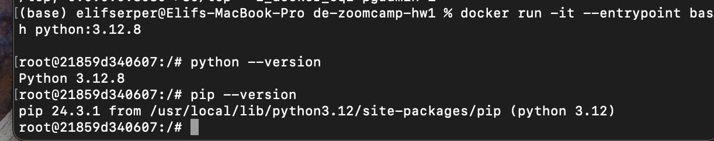
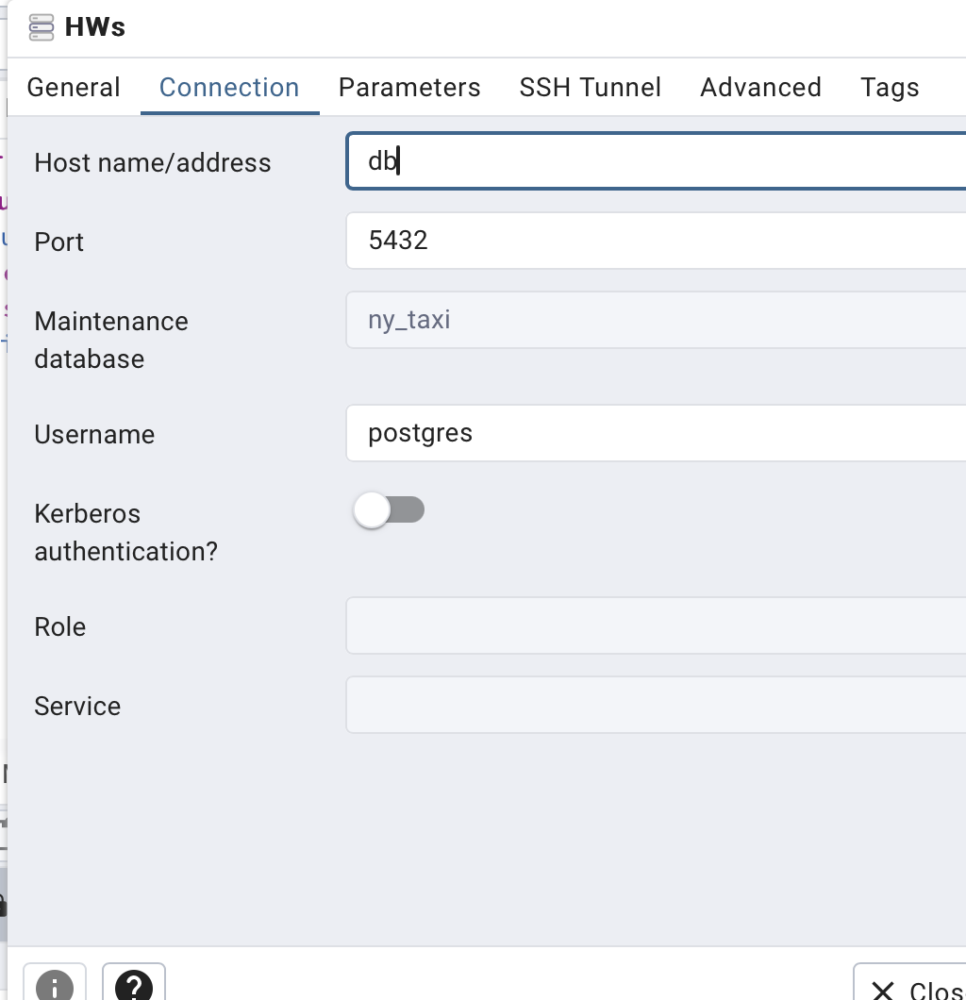
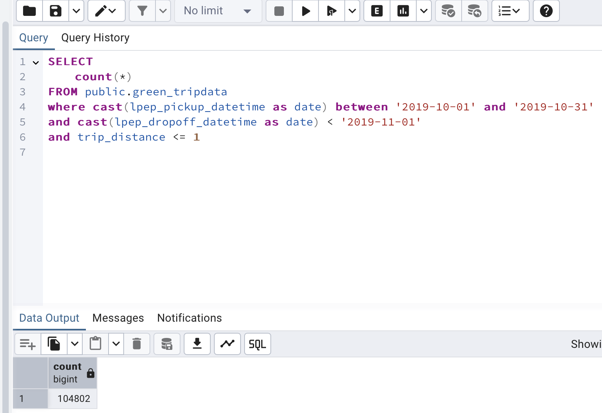
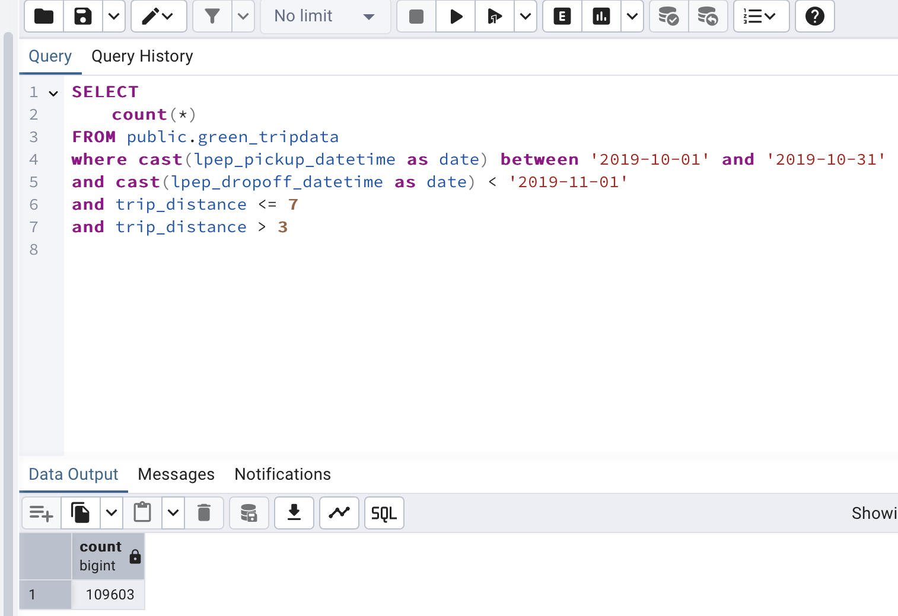
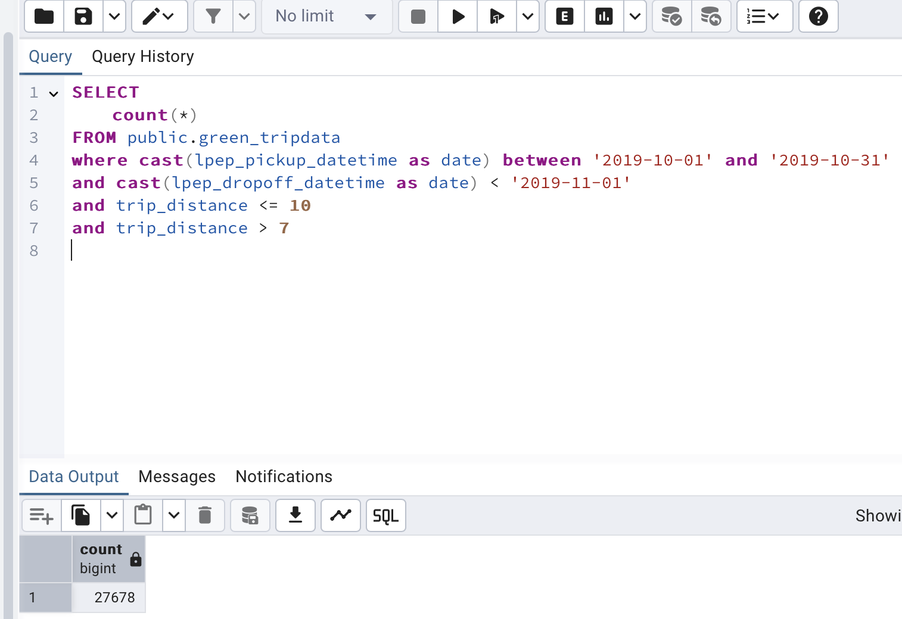
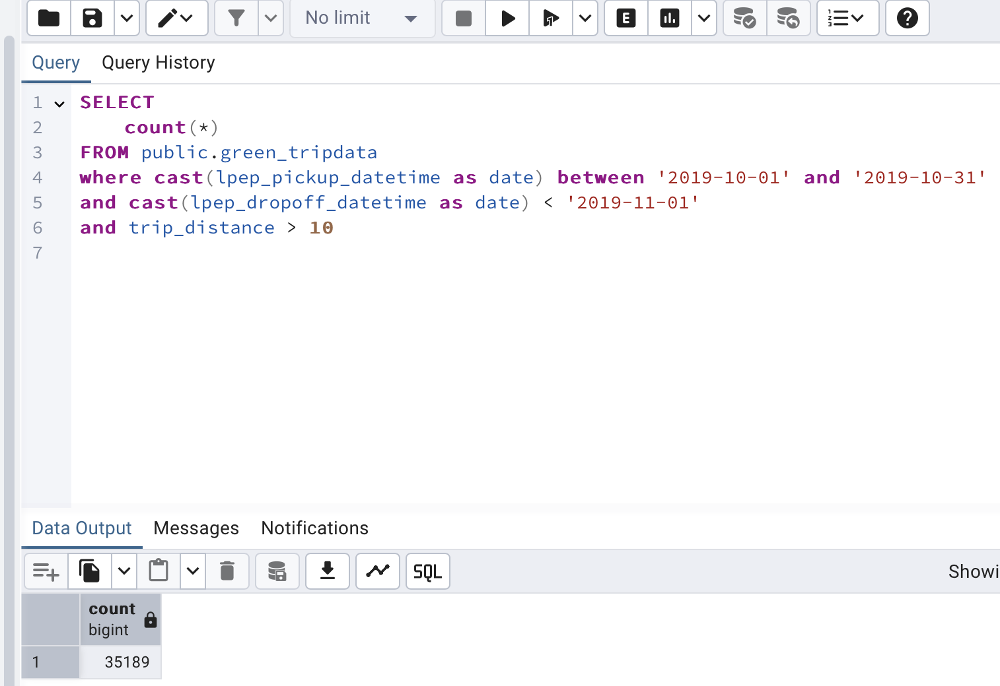
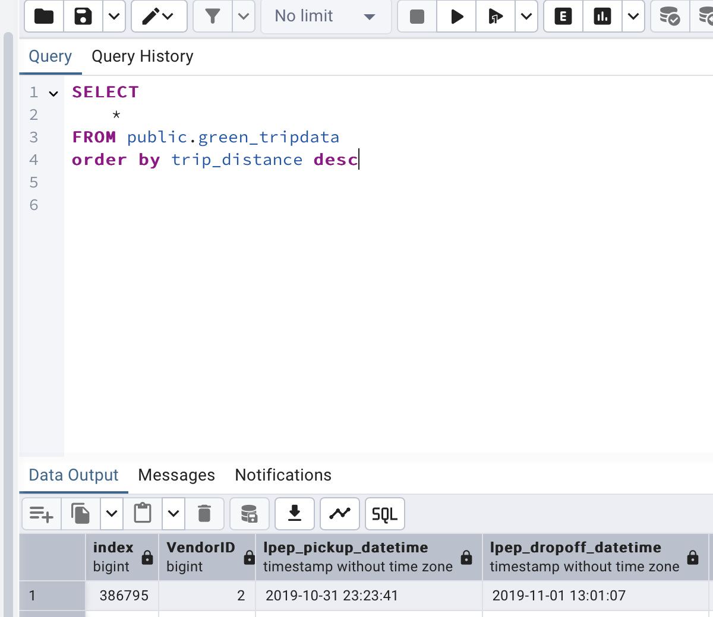
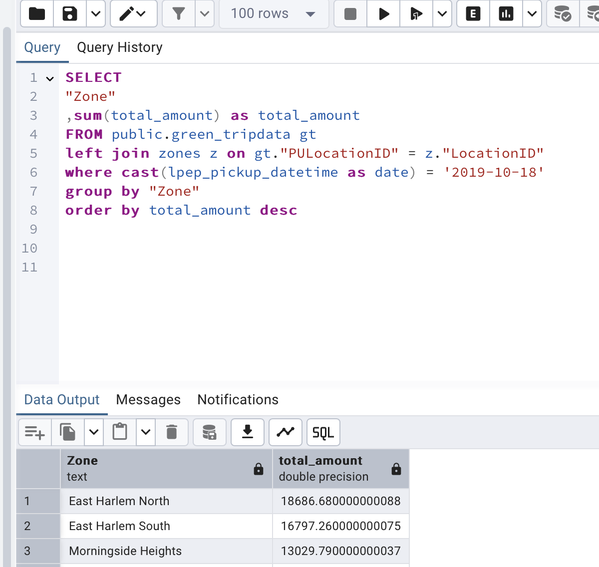
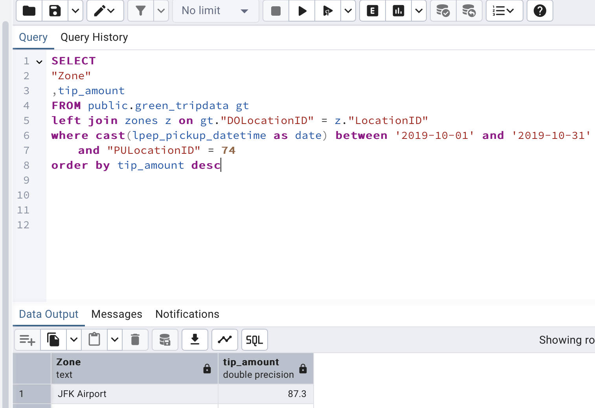

-> Question 1. Answer

-> Question 2. Answer

-> Question 3. Answer

 Up to 1 mile

        SELECT 
            count(*) 
        FROM public.green_tripdata
        where cast(lpep_pickup_datetime as date) between '2019-10-01' and '2019-10-31'
        and cast(lpep_dropoff_datetime as date) < '2019-11-01'
        and trip_distance <= 1

 In between 1 (exclusive) and 3 miles (inclusive)

        SELECT 
            count(*) 
        FROM public.green_tripdata
        where cast(lpep_pickup_datetime as date) between '2019-10-01' and '2019-10-31'
        and cast(lpep_dropoff_datetime as date) < '2019-11-01'
        and trip_distance <= 3 
        and trip_distance > 1

 In between 3 (exclusive) and 7 miles (inclusive)

        SELECT 
            count(*) 
        FROM public.green_tripdata
        where cast(lpep_pickup_datetime as date) between '2019-10-01' and '2019-10-31'
        and cast(lpep_dropoff_datetime as date) < '2019-11-01'
        and trip_distance <= 7 
        and trip_distance > 3

 In between 7 (exclusive) and 10 miles (inclusive)

        SELECT 
            count(*) 
        FROM public.green_tripdata
        where cast(lpep_pickup_datetime as date) between '2019-10-01' and '2019-10-31'
        and cast(lpep_dropoff_datetime as date) < '2019-11-01'
        and trip_distance <= 10 
        and trip_distance > 7

    5. over 10:

        SELECT 
            count(*) 
        FROM public.green_tripdata
        where cast(lpep_pickup_datetime as date) between '2019-10-01' and '2019-10-31'
        and cast(lpep_dropoff_datetime as date) < '2019-11-01'
        and trip_distance > 10

-> Question 4. Answer

    SELECT 
        *
    FROM public.green_tripdata
    order by trip_distance desc

-> Question 5. Answer

    SELECT 
        "Zone"
        ,sum(total_amount) as total_amount
    FROM public.green_tripdata gt
    left join zones z on gt."PULocationID" = z."LocationID"
    where cast(lpep_pickup_datetime as date) = '2019-10-18'
    group by "Zone"
    order by total_amount desc

-> Question 6. Answer

    SELECT 
        "Zone"
        ,tip_amount
    FROM public.green_tripdata gt
    left join zones z on gt."DOLocationID" = z."LocationID"
    where cast(lpep_pickup_datetime as date) between '2019-10-01' and '2019-10-31'
        and "PULocationID" = 74
    order by tip_amount desc

